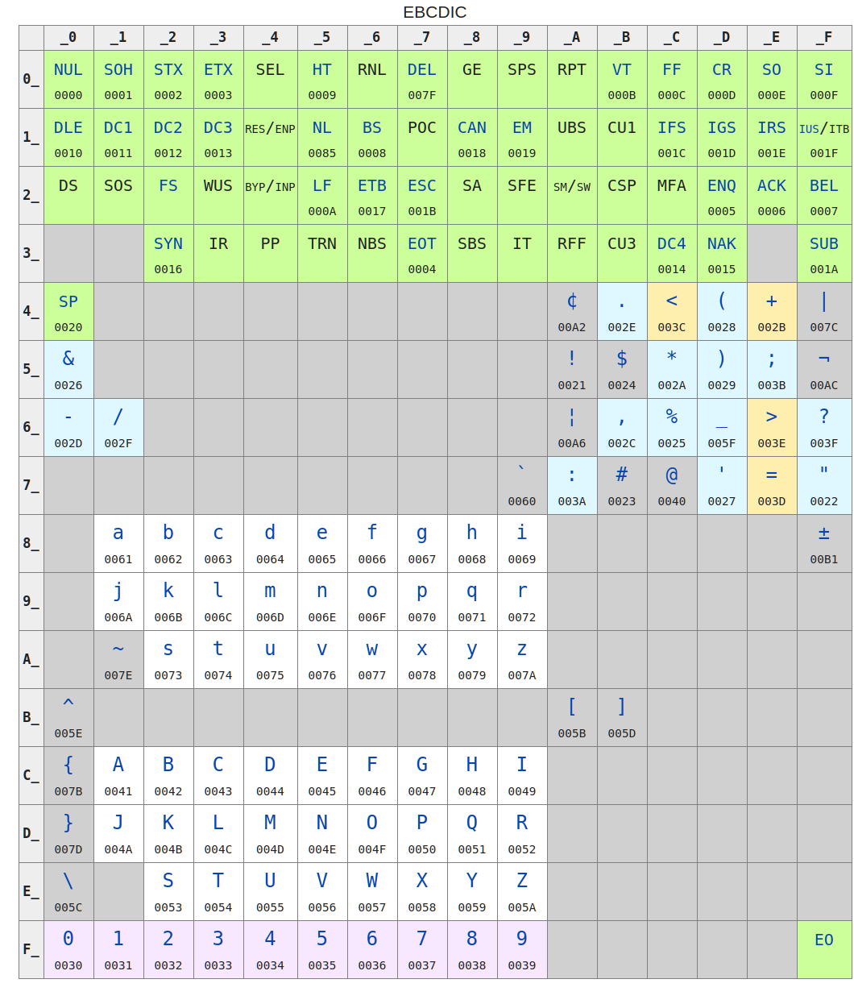
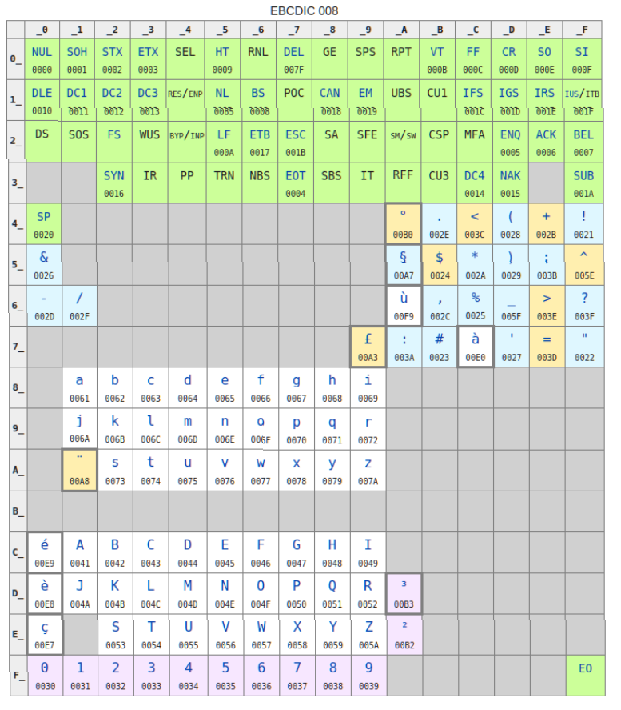

稍微整理了一下
<!-- more -->

## 字符集与编码的关系

代码点（Code Point）： 无符号整数

字符集（Char Set）：代码点到字符的映射

编码系统（Encoding）：将代码点"编码"成二进制数据和将二进制数据”解码“成代码点的机制

代码点的概念只有对于 Unicode 系统有意义，对于简单的字符集和编码系统而言，可以把编码系统看作字符到二进制数据的映射。

重要的是，字符和代码点都是存在于概念之中的，并不是具体的数据，编码系统的用处就是在概念之中的字符和二进制数据之间相互转换。

### 同一个字符集可以有多种编码

要定义一种字符编码，需要先定义它支持的字符集，比如 ASCII 编码支持的字符集就是 ASCII 表内的所有字符。因此，如果我们知道一段文本使用的字符编码，我们可以确定这段文本中所有的字符都属于某一个字符集。但对于相反的情况，即使确定了了一段文本的字符集也不能确定使用的编码。

假设有一种语言 L-1，只有 A、B、C 三个字符，不存在小写字符，我们可以为它定义一个字符集 CS-1。如果我们需要通过网络把一段 L-1 语言， CS-1 字符集的文本传输到远方，就需要将这段文本编码（encode）成二进制数据。

鉴于 A，B，C 都是存在于 ASCII 表内的字符，一种思路是直接使用 ASCII 编码。

| bits     | character |
| -------- | --------- |
| 01000001 | A         |
| 01000010 | B         |
| 01000011 | C         |

对于 CS-1 字符集文本`ABCBB`，它的 ASCII 编码为`0100000101000010010000110100000101000001`。很明显，采用 ASCII 编码时，数据的带宽利用率并没有达到最高，即使把编码内所有`010000`都去掉依然可以表达 CS-1 字符集内的所有字符，并不需要像 ASCII 编码那样使用8比特表示一个字符。

定义一种新编码，E-1：

| bits | character |
| ---- | --------- |
| 01   | A         |
| 10   | B         |
| 11   | C         |

对于 CS-1 字符集文本`ABCBB`，它的 E-1 编码为`0110110101`。

### 字符编码可以支持多个已经存在的字符集

对于先存在字符集，后定义字符编码的情况，字符编码的字符集是它需要支持的所有字符集的超集。

早期的 Windows-936 编码制定目标是支持 `GB2312` 字符集，在之后的版本中多次扩展了支持的字符种类，可以完整支持 `GBK` 字符集和一些其他符号（比如欧元符号 € ）。

## 编码表和代码页（Code Page）

因为一个字节的二进制数据可以用两个十六进制数字表示，所以对于单字节长度的编码系统，存在一种用 16 × 16 表格表示编码的方法。比如 EBCDIC 编码表：



如果想要对字符`a`进行 EBCDIC 编码，查阅上表得到对应位置 _8 行 _1 列，也就是十六进制数字 81，二进制表示`10000001`。

考虑到世界上文字的总数，如何表示超过单个字节表示能力的字符很快成为了必须解决的问题。

一种思路是，使用不变的字节数表示单个字符，并按照系统的实际需求使用不同的方式代码表，比如对于需要显示法文字母的系统使用 EBCDIC 008。



这些不同的代码表被称为代码页（Code page）。

## 固定长度多字节编码系统

另一种思路是为每个字符分配更多的字节。定义一种新编码，E-2。E-2 将 L-2 的每个字符拆分成两部分，用两个字节分别表示。

假定存在语言 L-2，包含 A<sub>001</sub> 到 C<sub>999</sub>，总共 3 × 999 = 2997 个字符。 定义字符集 CS-2，包含 L-1和 L-2 的全部字符。如何才能用二进制数据表示 L-2 语言的文本呢？

| bits              | character       |
| ----------------- | --------------- |
| 00000001 00000000 | A               |
| 00000010 00000000 | B               |
| 00000011 00000000 | C               |
| 00000001 00000001 | A<sub>001</sub> |
| 00000001 00000010 | A<sub>002</sub> |
| 00000001 00000011 | A<sub>003</sub> |
| ...               | ...             |

使用超过一个字节表示的字符称为宽字符（Wide character）。

使用长度固定为两个字节表示每个字符的编码被称为 DBCS ( double-byte character set ) ，也存在 TBCS 等。

这种固定字节长度的编码系统存在着两个缺点：

1. 限制了字符集的字符数量，比如用 DBCS 至多可以表示2<sup>16</sup>种字符。编码系统的设计者不得不在多种语言的支持中做出取舍，在发展的过程中诞生了无数无标准/半标准化的编码。比如某个开发者需要系统同时处理希腊字母和俄语字母，而当时的编码规范中没有可以同时支持这两种字符集的，则这个开发者便不得不发明一种新编码。这也是有这么多不同的编码规范存在的原因之一。
2. 在空间利用率上存在缺陷，比如用 DBCS 保存文本，即使文本中只包含 ASCII 编码中的字符，依然要付出两倍的空间。

为此人们发明出了可变长度编码系统，并制定了 Unicode 标准，

## 可变长度编码系统

可变长度编码系统中，每个字符的二进制编码可能是一到多个字节，系统通过一些规则将二进制数据流切割成字符。比如将每个字节第一位作为是否有后续数据的标识位（这只是方法之一）。

这种编码系统引入了代码单元（Code Unit）的概念。某个编码系统的代码单元是该编码系统表示单个字符时所能使用的最少比特位数，同时也是编码系统解码二进制数据时处理的最小单元。比如对于代码单元为8比特的编码系统，每个字符可能用 8，16，24……个比特表示，对于代码单元为16比特的编码系统，每个字符可能用16，32，48……个比特表示。

## Unicode

为了保证编码传输的一致性，人们从上世纪八十年代末期就开始寻求一种可以表示大部分文字的编码方案，unicode 正是这种努力的产物，直到今天 unicode 标准也在不停更新之中。

Unicode 定义了从 0 到 10FFFF 总计一百多万个代码点，其中 0 到 FFFF 被定义为 BMP（ [Basic Multilingual Plane](https://en.wikipedia.org/wiki/Basic_Multilingual_Plane) ）。Unicode 的代码点有大量空余，这保证了它有充足的扩展空间。Unicode 12.1 定义了137,994个字符和代码点的映射关系。Unicode的代码点可以用`\u` + 数字表示。比如`\u2466`（对应字符⑦）。

Unicode 是一个字符集，但并不是编码系统，有多种编码系统支持 unicode 。

- UCS-2：使用固定长度2字节表示每个字符，严格把代码点一对一映射到整数，只能表示 BMP 内的字符（`\u0000` - `\uFFFF`）。Windows XP使用UCS-2编码。现代软件很多都不再支持 UCS-2，如果我们需要读取 UCS-2 编码的文件，可以直接当作 UTF-16 解码。
- UCS-4：使用固定长度4字节表示每个字符，严格把代码点一对一映射到整数，范围 `00000000` - `7FFFFFFF`。可以表示所有的 unicode 代码点。
- UTF-8：使用一字节长度代码单元的可变长度编码系统，互联网上超过90%的网页使用 UTF-8 编码，事实上的网页标准。对于 UTF-8，若一个代码单元第一个比特为0，说明这是一个 ASCII 字符，若为1，则1连续出现的数量表示这个字符占用的字节数。若一个代码单元是110xxxxx，则这个字符占用2字节，若为1110xxxx，则这个字符占用3个字节。
- UTF-16：UCS-2 的扩展，使用两字节长度代码单元的可变长度编码系统。利用 BMP 内 `D800` - `DFFF`的保留空间保存字符编码信息。具体过程比较复杂。
- UTF-32：与 UCS-4 唯一的区别是去掉了超过 10FFFF 的代码点，实际上没有区别。
- GB18030：中国的官方标准编码，实现了对unicode字符集的完整支持（但并不是官方的 unicode 编码系统）。2006 年开始在中国售卖的软件产品需要支持GB18030。

| bits                                | encoding | character |
| ----------------------------------- | -------- | --------- |
| 01000001                            | UTF-8    | A         |
| 00000000 01000001                   | UTF-16   | A         |
| 00000000 00000000 00000000 01000001 | UTF-32   | A         |
| 11100100 10111000 10000000          | UTF-8    | 一        |
| 01001110 00000000                   | UTF-16   | 一        |
| 00000000 00000000 01001110 00000000 | UTF-32   | 一        |

此外还存在 UTF-1，UTF-7，UTF-EBCDIC 等已经被淘汰或有特殊用途的编码系统。

对于 UTF-16 等代码单元长度超过一个字节的系统，还存在着数据 endian 的问题，所以还能分为 UTF-16LE，UTF-16BE等系统。

`Python 3` 内部会根据字符范围动态选择 latin-1（ISO 8859 定义的单字节编码）， UCS-2 或 UTF-32 保存字符串。

[ES5 标准](http://es5.github.io/x2.html#x2)允许 `javascript` 引擎使用 UCS-2 或 UTF-16 保存字符串，由于 UCS-2 编码只能表示 BMP 内的字符，造成了某些情况下的兼容性问题。

## 尝试一下

```python
def char2bin(s, encoding):
    return ' '.join(map(lambda x: f'{bin(x)[2:]:>08}', s.encode(encoding)))

char2bin('我', 'utf_16_be')
```

## 网站可以正常运行，为什么数据库里会有乱码？

一种常见的问题是，网站可以正常输出网页，但使用数据库客户端直接访问数据库时却得到了乱码。原因在于数据库保存的是二进制数据，也就是“编码”的产物。比如数据库中保存了 GBK 编码的字符串“我”，二进制数据为`11001110 11010010`，却错误的把默认的编码格式设置成了 UTF-16。当网站读取到二进制数据之后，后端代码按照 GBK 编码进行解码，可以正常解码。当使用数据库客户端查询数据时，客户端按照 UTF-16 进行解码，最终得到了 `컒`。

## Ref

[术语表](https://unicode.org/glossary/)
